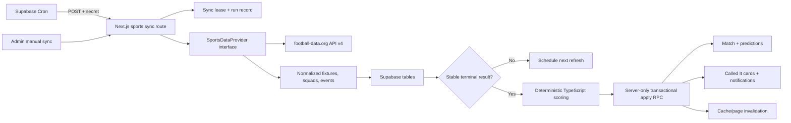

# Called It — Live Sports Data, Automated Results/Cards, and Profile Completion Plan

**Document status:** Implementation-ready plan  
**Prepared:** 2026-07-11  
**Runtime changes included in this document:** None  
**Primary provider:** football-data.org API v4  
**Application architecture:** Existing Next.js App Router modular monolith with Supabase Postgres/Auth

This document is the execution contract for the next development phase. An AI agent following it must read this document together with `AGENTS.md`, `MEMORY.md`, `called-it-prd.md`, and `called-it-technical-design.md` before changing code.

## 1. Source precedence and implementation rules

Resolve conflicts in this order:

1. A newer direct user instruction.
2. `AGENTS.md`.
3. `called-it-prd.md`.
4. `called-it-technical-design.md`.
5. This plan.
6. Existing implementation details.

If implementation must deviate from this plan, record the reason and replacement decision in `MEMORY.md` before marking the work complete.

Required workflow for every phase:

1. Translate the phase into focused acceptance criteria.
2. Inspect all affected files and migrations.
3. Add or update tests first where behavior is testable.
4. Implement the smallest safe increment.
5. Run narrow tests, database verification, then broader checks.
6. Update `MEMORY.md` immediately with changes, validation, and remaining risks.

Do not combine every phase into one unreviewable change. Each phase below must leave the application in a deployable state.

## 2. Current baseline

The agent must build on the existing implementation rather than replace it.

- Authentication, profile row creation, protected pages, and Supabase clients already exist.
- `profiles` already has `username`, `display_name`, `favorite_team_id`, `avatar_url`, `country_code`, `bio`, searchability, and visibility fields.
- The profile UI currently displays data but does not provide onboarding or general profile editing.
- `matches`, `teams`, `players`, and `tournaments` already contain provider-facing `external_id` fields.
- Prediction submission is enforced through the authenticated `submit_prediction` RPC and server time.
- Deterministic scoring exists in `lib/scoring/calculate-score.ts`.
- Manual result processing exists at `POST /api/admin/process-results`.
- Result processing already calls `syncCalledItCards`, which issues or revokes cards.
- Called It public pages, visibility controls, rarity, and earned-card notifications already exist.
- Seeded demo data must remain functional when football-data.org is unavailable.
- Unit tests currently cover scoring, PostgreSQL-style UUID validation, Called It rarity, and AI output contracts.

Important current limitations this plan addresses:

- There is no sports-provider client, fixture sync service, sync scheduler, sync audit trail, or quota guard.
- Real fixture completion does not automatically call result processing.
- Result processing performs multiple writes and can be partially applied if a later write fails.
- Called It notification deduplication is not database-enforced.
- Provider corrections are supported by `result_version`, but no automated provider correction loop exists.
- Team rosters are not snapshotted per match.
- New users are not required to finish username, display name, and favourite-team onboarding.

## 3. Product goals

### 3.1 Goal A — real match data

The application must import and maintain a configured real competition so users can:

- See actual upcoming fixtures, teams, kickoff times, stages, and player choices.
- Submit and edit predictions only while the real match is open.
- See schedule changes, postponements, cancellations, and live/finished states reflected safely.
- Receive final points after an official result is confirmed.
- Continue using the last known data if the provider is temporarily unavailable.

### 3.2 Goal B — automatic result and Called It lifecycle

When a provider result is confirmed, the system must automatically:

1. Store regulation-time and final result facts.
2. Identify the first official goalscorer, including own-goal and 0–0 handling.
3. Recalculate every prediction deterministically.
4. Update leaderboard inputs.
5. Issue, update, revoke, or reissue Called It cards idempotently.
6. Create deduplicated notifications.
7. Re-run the same lifecycle if the provider corrects the result.

No AI model or sports-provider prediction endpoint may determine points, rank, or card eligibility.

### 3.3 Goal C — complete user profiles

Every authenticated user must complete the following before using the main application:

- Unique username.
- Display name.
- Favourite team.

Email remains owned by Supabase Auth and is not duplicated as editable profile data. Avatar, country, bio, searchability, and profile visibility remain optional/editable.

### 3.4 Explicit non-goals

- Betting odds, provider predictions, gambling advice, fantasy squads, and paid advantages.
- Event-by-event user predictions.
- A full live commentary feed.
- Snowflake, Redis, queues, or separate microservices for this phase.
- Native mobile push notifications.
- Automatic scoring of abandoned matches, walkovers, or technical awards without an explicit later product rule.
- Changing the existing points model or adding knockout advance points. Import `advanced_team_id`, but preserve the current scoring behavior unless the product owner separately approves a scoring change.

## 4. Product requirements and acceptance criteria

The implementation must satisfy these requirements from the PRD and TDD.

### 4.1 Accounts and profiles

- A profile row is created after email/password or Google signup.
- A user chooses a unique username and favourite team before entering the dashboard.
- A user can later edit their profile.
- Username uniqueness is enforced by PostgreSQL, not only by a preflight UI check.
- Required profile fields cannot be bypassed by directly navigating to protected pages.
- Existing users with incomplete profiles are redirected to onboarding without losing account data.
- Favourite-team options come from teams in the active competition; seeded teams remain available in demo mode.

### 4.2 Match data and prediction deadlines

- Real fixtures are imported using stable provider IDs while internal primary keys remain UUIDs.
- All timestamps are stored in UTC and displayed in the browser's local timezone.
- A changed kickoff time updates the prediction deadline only while the match has never started.
- A match that has started can never reopen predictions because of a later provider timestamp correction.
- The submission RPC rejects a mutation when server time is at/after kickoff, the match is not scheduled, or a server-owned closed timestamp has been set.
- Postponed matches may reopen only when the provider supplies a new future kickoff and the match never started.
- Suspended or interrupted matches remain closed.
- Cancelled, abandoned, walkover, and technical-award matches are not scored automatically.

### 4.3 Results and scoring

- Only stable terminal provider statuses (`FT`, `AET`, or `PEN`) are eligible for automatic confirmation.
- Non-zero results are not confirmed until a valid first-goal event is available.
- A 0–0 result is confirmed with `first_goalscorer_id = null` and no-goalscorer predictions are handled by the existing scoring function.
- An own goal is stored with `first_goal_was_own_goal = true`; it does not award first-goalscorer points under current product rules.
- Knockout score prediction remains based on regulation time.
- Reprocessing the same provider result does not increment `result_version` or duplicate any effect.
- A changed confirmed result increments `result_version` exactly once after the corrected result stabilizes.

### 4.4 Called It cards

- Cards are created only by server-owned result processing.
- A user has at most one logical card for one prediction/match.
- A card is issued only when the existing deterministic score reports `isCalledIt = true`.
- Confidence multiplier does not affect eligibility.
- A correction can revoke or reissue the same logical card.
- Public visibility chosen by the owner is preserved across result corrections.
- Public reads exclude revoked cards.
- Earned/revoked/reissued notifications are deduplicated by event and result version.

### 4.5 Reliability

- The API key is never exposed to a browser.
- Provider failures preserve last-known-good data.
- Provider payload validation failures cannot overwrite valid records with null or malformed values.
- Concurrent scheduler calls cannot process the same sync scope or match simultaneously.
- The system stays within a configurable request budget and reserves capacity for terminal-result confirmation.
- Seeded demo data and manual result processing continue to work when live sync is disabled.

## 5. Architecture decision

Keep all provider and scoring code inside the existing Next.js application. Use Supabase Cron only as a scheduler that invokes a protected Next.js route. This preserves the modular monolith and avoids duplicating business logic in a Supabase Edge Function.



The scheduler is replaceable. If Supabase Cron is unavailable, the same protected route must work through a manual admin request or a Vercel Pro cron. Vercel Hobby cron is not the primary scheduler because its current minimum interval is once per day.

## 6. Sports provider module design

Create a provider boundary under `lib/sports/`.

Suggested files:

```text
lib/sports/
  contracts.ts
  status.ts
  sync-policy.ts
  sync-service.ts
  result-normalizer.ts
  repository.ts
  providers/
    football-data/
      client.ts
      schemas.ts
      normalize.ts
      provider.ts
  testing/
    fixtures.ts
    fake-provider.ts
```

### 6.1 Provider interface

Implement an interface equivalent to:

```ts
interface SportsDataProvider {
  getCompetitionFixtures(input: CompetitionRef): Promise<NormalizedFixture[]>;
  getFixturesByIds(externalIds: string[]): Promise<NormalizedFixture[]>;
  getFixtureEvents(externalFixtureId: string): Promise<NormalizedMatchEvent[]>;
  getTeamSquad(externalTeamId: string): Promise<NormalizedPlayer[]>;
  getFixtureLineups?(externalFixtureId: string): Promise<NormalizedLineup[]>;
}
```

Application services must consume normalized types only. No component, scoring module, action, or database query may depend on football-data.org response shapes.

### 6.2 football-data.org calls

Use the official v4 base URL and `X-Auth-Token` header server-side. Prefer competition codes such as `PL`, `WC`, and `CL`; numeric competition IDs are also supported.

- Competition metadata: `GET /v4/competitions/{competitionCodeOrId}`.
- Competition schedule: `GET /v4/competitions/{competitionCodeOrId}/matches?season={year}&dateFrom={yyyy-mm-dd}&dateTo={yyyy-mm-dd}`.
- Individual fixture refresh: `GET /v4/matches/{matchId}`.
- Competition teams and squad metadata: `GET /v4/competitions/{competitionCodeOrId}/teams?season={year}` or `GET /v4/teams/{teamId}`.
- Include embedded match detail with `X-Unfold-Goals: true`, `X-Unfold-Lineups: true`, and `X-Unfold-Subs: true` on match list/detail requests.
- Use the embedded `goals`, `homeTeam.lineup`, `homeTeam.bench`, `awayTeam.lineup`, and `awayTeam.bench` fields instead of assuming separate event/lineup endpoints exist.

Do not call the provider's odds or prediction resources.

### 6.3 HTTP behavior

The provider client must:

- Use an abort timeout.
- Validate every response with Zod before normalization.
- Treat a provider error object or non-2xx response as a failure; football-data.org uses an `error` response field.
- Retry only 429, timeout, and transient 5xx failures with bounded exponential backoff and jitter.
- Never retry invalid credentials or other permanent 4xx errors.
- Record request count, duration, endpoint category, and sanitized error code.
- Never log the API token, authorization headers, full user data, or private predictions.
- Capture actual quota headers returned by the configured account after a live contract check; do not invent header names from memory.

### 6.4 Normalized fixture contract

At minimum, normalize:

```ts
type NormalizedFixture = {
  provider: "football-data";
  externalFixtureId: string;
  externalCompetitionId: string;
  season: string;
  stage: string;
  kickoffAt: string | null;
  kickoffConfirmed: boolean;
  providerStatus: "SCHEDULED" | "TIMED" | "IN_PLAY" | "PAUSED" | "EXTRA_TIME" | "PENALTY_SHOOTOUT" | "FINISHED" | "SUSPENDED" | "POSTPONED" | "CANCELLED" | "AWARDED";
  lifecycleStatus: "scheduled" | "live" | "finished_candidate" | "postponed" | "cancelled";
  homeTeam: NormalizedTeam;
  awayTeam: NormalizedTeam;
  score90: { home: number; away: number } | null;
  scoreFinal: { home: number; away: number } | null;
  penaltyScore: { home: number; away: number } | null;
  winnerExternalTeamId: string | null;
  events: NormalizedMatchEvent[];
  providerUpdatedAt: string | null;
};
```

### 6.5 Provider status mapping

| football-data.org status | Internal behavior | Predictions | Automatic scoring |
|---|---|---|---|
| `SCHEDULED`, `TIMED` | Scheduled | Open only before confirmed kickoff | No |
| `IN_PLAY`, `PAUSED`, `EXTRA_TIME`, `PENALTY_SHOOTOUT` | Live | Closed permanently | No |
| `SUSPENDED` | Suspended display state | Closed permanently | No |
| `FINISHED` | Finished candidate | Closed | After confirmation gate |
| `POSTPONED` | Postponed | Reopen only if never started and a new future kickoff is confirmed | No |
| `CANCELLED`, `AWARDED` | Cancelled/not playable under current rules | Closed | Manual review only |

Keep the provider's original status in `provider_status` so the UI can distinguish halftime, extra time, suspension, and similar states without expanding the public `match_status` enum immediately.

### 6.6 Score semantics and contract verification

Before production activation, add recorded contract fixtures for one regular finished match, one extra-time/penalty-shootout cup match if the selected competition provides them, one 0–0, and one own-goal match. Verify football-data.org's `score.duration`, `score.fullTime`, `score.extraTime`, `score.penalties`, `goals`, and lineup semantics against those real examples.

Required rule:

- `score.duration = REGULAR` uses `score.fullTime` as the regulation-time result.
- `score.duration = EXTRA_TIME` uses `score.fullTime` for the played final result and requires a verified regulation-time value if the selected competition exposes it.
- `score.duration = PENALTY_SHOOTOUT` stores the played result separately from shootout penalties and requires a verified regulation-time value before automatic scoring.
- Extra-time and shootout totals must not contaminate regulation-time scoring.
- `home_score_final` and `away_score_final` represent the played final score excluding shootout kicks.
- `score.penalties` may be stored separately for display/audit.
- `advanced_team_id` is mapped from the provider winner for knockout fixtures.

If the provider response is ambiguous or contradicts the recorded contract, stop automatic processing for that fixture and mark it `manual_review`; do not guess.

### 6.7 First official goalscorer

Sort the football-data.org `goals` array by `minute`, `injuryTime`, and source order. The first valid goal with type `REGULAR`, `PENALTY`, or `OWN` is the first official goal. The provider's documented goal types do not include a separate cancelled-goal event, so automatic processing must defer when a match's goal list conflicts with its score or a later correction changes the first goal.

- Regular goal or penalty: resolve the provider `scorer.id` to the match-player snapshot and store it.
- Own goal: store the resolved player when available and set `first_goal_was_own_goal = true`; current scoring awards no player bonus.
- 0–0: require no valid goal events and set the scorer to null.
- Non-zero score with no resolvable first goal: mark `manual_review` and defer points/cards.

The normalizer must have focused tests for equal-minute goals, injury time, own goals, missing scorers, score/goal-count conflicts, missing lineups, and 0–0.

## 7. Database design and migrations

Create migrations with `npx supabase migration new <descriptive_name>`. Do not invent migration timestamps. Every new table in `public` must have explicit grants and RLS because new Supabase projects no longer expose public tables automatically.

### 7.1 Provider identity

Add `provider text not null default 'seed'` to `tournaments`, `teams`, `players`, and `matches`.

Replace single-column provider-ID uniqueness with composite uniqueness:

- `unique (provider, external_id)` on each provider-backed table.
- Preserve UUID primary keys and all existing foreign keys.
- Existing seeded rows become `provider = 'seed'`.
- Imported rows use `provider = 'football-data'`.

Do not overwrite seeded records with live provider rows merely because names match.

### 7.2 Tournament configuration

Extend `tournaments` with:

- `provider_coverage jsonb not null default '{}'` for event/lineup/player capability flags.
- `last_synced_at timestamptz`.
- `next_sync_at timestamptz`.
- `sync_enabled boolean not null default false`.

The agent must not guess a competition code/ID or season. Activation requires an explicitly configured football-data.org competition code/ID in `external_id`, a season, and `sync_enabled = true`.

### 7.3 Match lifecycle fields

Extend `matches` with:

- `provider_status text`.
- `kickoff_confirmed boolean not null default true` for existing rows.
- `actual_started_at timestamptz`.
- `predictions_closed_at timestamptz`.
- `penalty_home_score smallint` and `penalty_away_score smallint`.
- `result_candidate_hash text`.
- `result_candidate_seen_at timestamptz`.
- `result_candidate_observations smallint not null default 0`.
- `result_processing_status text not null default 'not_ready'` constrained to `not_ready`, `candidate`, `processing`, `processed`, `manual_review`, or `failed`.
- `result_processed_at timestamptz`.
- `next_sync_at timestamptz`.
- `sync_failure_count integer not null default 0`.
- `sync_last_error_code text`.

Add indexes for:

- `(status, next_sync_at)`.
- `(provider, external_id)`.
- `(result_processing_status, next_sync_at)`.
- `(tournament_id, kickoff_at)` if the existing index is not sufficient for due-work queries.

Do not expose sanitized internal failure details to normal users.

### 7.4 Match-player snapshots

Add `match_players`:

| Column | Purpose |
|---|---|
| `match_id uuid` | Match foreign key |
| `player_id uuid` | Internal player foreign key |
| `team_id uuid` | Team represented in this match |
| `source text` | `squad`, `lineup`, or `event` |
| `lineup_role text` | `starter`, `substitute`, `squad`, or null |
| `is_active boolean` | Available for new predictions |
| `first_seen_at`, `last_seen_at` | Audit timestamps |

Use `primary key (match_id, player_id)` and indexes on `match_id` and `team_id`.

Populate snapshots from team squads when fixtures are imported. Upgrade records from lineup data when available. Never delete a snapshotted player referenced by a submitted prediction. Update the prediction RPC to validate first-goalscorer choices against `match_players`, while retaining a safe compatibility path for seeded fixtures during migration.

### 7.5 Match events

Add a server-managed `match_events` table for normalized result facts:

- `id uuid primary key`.
- `match_id uuid not null`.
- `provider text not null`.
- `provider_event_key text not null`.
- `source_order integer not null`.
- `elapsed smallint` and `extra smallint`.
- `event_type text not null`.
- `detail text`.
- `team_id uuid` and `player_id uuid`.
- `is_goal boolean not null default false`.
- `is_own_goal boolean not null default false`.
- `is_cancelled boolean not null default false`.
- `payload_hash text not null`.
- timestamps.

football-data.org goal records do not provide a dependable application UUID. Build `provider_event_key` deterministically from goal minute, injury time, type, team ID, scorer ID, score, and source order; enforce `unique(match_id, provider_event_key)`.

Do not grant browser write access. Browser read access is unnecessary for this phase; keep the table server-only unless a later live-event UI is approved.

### 7.6 Sync runs and leases

Add server-only tables:

`sports_sync_runs`:

- Trigger type: cron, admin, stale-read, or test.
- Scope: competition, due fixtures, or one fixture.
- Status: running, succeeded, partial, failed, or skipped.
- Started/finished timestamps.
- Fixture/team/player/event counts.
- Provider request count and duration.
- Sanitized error code/message.
- Provider quota snapshot when available.

`sports_sync_leases`:

- `lease_key text primary key`.
- `holder_id uuid`.
- `acquired_at timestamptz`.
- `expires_at timestamptz`.

Provide a server-only atomic RPC to acquire or renew a lease only when the current lease is expired or owned by the same holder. Use separate keys for global fixture sync and `match:{uuid}` result processing. A crashed invocation must recover after lease expiry.

### 7.7 Notification deduplication

Add `dedupe_key text` to `notifications` and a unique partial index where the key is not null.

Use deterministic keys such as:

- `called-it:{predictionId}:result:{resultVersion}:earned`.
- `called-it:{predictionId}:result:{resultVersion}:revoked`.
- `points:{predictionId}:result:{resultVersion}`.

Insertion must use conflict-safe behavior. Re-running the same result version must create zero duplicate notifications.

Harden card identity in the same migration sequence:

- Replace the current active-only unique index with one logical-row constraint on `called_it_cards(prediction_id)` after first checking and reconciling any historical duplicates.
- A correction revokes or reactivates that row; it does not insert a second card or change its public slug.
- Preserve `is_public` on every automated update.
- If detailed lifecycle history is needed, add a server-only `called_it_card_events` audit table keyed by card, result version, and event type instead of duplicating card rows.
- Keep direct insert, update, and delete unavailable to `anon` and `authenticated`.

### 7.8 Profile completeness fields and constraints

Extend `profiles` with:

- `onboarding_completed_at timestamptz`.

Add or tighten constraints:

- Username: 3–30 characters, lowercase letters, digits, and underscores only.
- Display name: trimmed length 1–60.
- Bio: retain the existing 280-character maximum.

Do not make `username` or `favorite_team_id` immediately `NOT NULL`, because existing users must migrate safely. A trigger may set or clear `onboarding_completed_at` based on valid required fields. Application authorization treats a null completion timestamp as incomplete.

Add an index on `favorite_team_id` if missing.

### 7.9 Grants and RLS

For every migration:

- Enable RLS on every new table in `public`.
- Explicitly grant only required operations because table exposure defaults changed in Supabase during 2026.
- Give `anon` no access to sync, event, lease, or run tables.
- Give `authenticated` no write access to tournaments, teams, players, matches, match events, sync tables, scoring fields, or Called It card records.
- Preserve authenticated read access needed by match/profile pages.
- Keep profile owner update RLS using both `USING (id = (select auth.uid()))` and `WITH CHECK (id = (select auth.uid()))`.
- Revoke broad profile table updates and grant only editable columns where practical.
- Never authorize using `user_metadata`.
- Keep secret/service-role clients server-only.

Any server-only RPC exposed in `public` must be `SECURITY INVOKER` where possible, have execute revoked from `PUBLIC`, `anon`, and `authenticated`, and be granted only to `service_role`. If `SECURITY DEFINER` is unavoidable, document why, use a fixed empty/safe search path, validate the actor or caller, revoke default execute immediately, and run security advisors.

## 8. Sync orchestration

### 8.1 Entry points

Add:

- `POST /api/admin/sports-sync` for a secret-authenticated manual run.
- `POST /api/cron/sports-sync` for scheduled due work.

Accepted scopes:

- `competition`: import/refresh the configured schedule, teams, and squad snapshots.
- `due`: claim and refresh the next bounded batch of due fixtures.
- `fixture`: refresh one known fixture by internal UUID; do not accept an arbitrary external ID that can consume quota.

Use a timing-safe secret comparison. Prefer a separate `SPORTS_SYNC_SECRET`; retain `ADMIN_SYNC_SECRET` for the existing manual result endpoint until migration is complete.

### 8.2 Supabase Cron

Use a source-controlled migration to enable/configure the supported Cron and async networking extensions only after verifying their current names with the pinned Supabase CLI and hosted project.

Store the application URL and sync secret in Supabase Vault. Schedule one job every minute that uses `net.http_post` to call the protected due-work route. Do not put secrets in migration text, source control, query parameters, or logs.

The cron invocation must be safe when delivered twice. Supabase recommends keeping cron jobs bounded; the due-work endpoint should process a small batch and return before the function limit.

If Vault values cannot be provisioned through a safe migration, document the one-time dashboard/SQL setup in `README.md` without recording secret values.

### 8.3 Due-work policy

Calculate `next_sync_at` based on lifecycle and configurable quota. Initial recommended policy:

| Fixture state | Target interval | Purpose |
|---|---:|---|
| Competition schedule | 6–24 hours | New fixtures, stages, schedule changes |
| Scheduled, more than 72h away | 12–24 hours | Low-cost freshness |
| Scheduled, 6–72h away | 30–60 minutes | Kickoff changes and squads |
| Scheduled, within 6h | 5–15 minutes | Late kickoff/status changes and lineups |
| Live | 1–5 minutes, configurable | Status and event updates |
| Terminal candidate | 1–2 minutes | Stable confirmation |
| Confirmed in last 2h | 10–15 minutes | Early correction detection |
| Confirmed 2–48h ago | 6–12 hours | Delayed corrections |
| Older confirmed fixture | Daily for seven days, then stop | Late correction safety |
| Postponed/TBD | 6–24 hours | New kickoff discovery |

football-data.org documents 10 requests/minute on its free plan, with higher plan limits. The actual cadence must respect the configured plan and the `X-RequestsAvailable`/`X-RequestCounter-Reset` response headers. Batch by date windows and avoid unnecessary individual fixture calls.

### 8.4 Quota guard

Add configuration for a conservative daily budget and reserve:

- `FOOTBALL_DATA_REQUESTS_PER_MINUTE`.
- `FOOTBALL_DATA_RESULT_RESERVE`.
- `SPORTS_SYNC_LIVE_INTERVAL_SECONDS`.

Rules:

1. Terminal candidates and unresolved non-zero results have highest priority.
2. Live fixtures are next.
3. Near-kickoff fixtures are next.
4. Full schedule and squad refreshes are deferred first when quota is low.
5. When the reserve is reached, do not spend it on badges, lineups, or already-fresh scheduled fixtures.
6. Record a sanitized `quota_deferred` run rather than treating it as provider failure.

After the first live request, compare configured limits with `X-RequestsAvailable` and `X-RequestCounter-Reset`, then update operational documentation.

### 8.5 Last-known-good behavior

On provider failure:

- Do not null scores, kickoff times, teams, players, or events.
- Increment failure count and schedule a bounded retry.
- Keep showing cached data with a freshness label when appropriate.
- Do not mark a match cancelled solely because a fixture is absent from one response.
- Reset failure state only after a valid normalized response is stored.
- Keep seeded/demo tournaments independent from live-provider sync.

## 9. Pre-match data flow

For a full competition sync:

1. Acquire the competition lease.
2. Create a sync-run record.
3. Fetch the configured league/season fixtures in UTC.
4. Validate and normalize the entire response.
5. Upsert tournament metadata without changing internal UUIDs.
6. Upsert teams by `(provider, external_id)`.
7. Upsert matches by `(provider, external_id)`.
8. Update kickoff and stage only under lifecycle safety rules.
9. Schedule squad refresh for newly seen teams.
10. Populate `match_players` from squad snapshots.
11. Mark missing fixtures for review, not deletion.
12. Set next sync times and finish the run record.

Kickoff update rules:

- Before actual start: accept a valid provider schedule change and let the new server-side kickoff control the deadline.
- At/after kickoff: the existing RPC already rejects new edits by server time.
- On first live status: set `actual_started_at` and `predictions_closed_at` if absent.
- After actual start: never clear `predictions_closed_at` and never reopen predictions.
- For a pre-start postponement: update to postponed; reopen only after a new confirmed future kickoff arrives.

The match page must read only from Supabase. It must never call football-data.org from the browser. A lightweight client refresh may re-read Supabase every 30–60 seconds for live fixtures.

## 10. Stable result confirmation

Do not equate the first terminal provider response with an immediately final result.

Build a canonical result candidate containing:

- Provider fixture ID and terminal status.
- Regulation-time score.
- Final score.
- Penalty score when present.
- First official goal facts.
- Advanced team.

Hash canonical JSON with stable key ordering.

Automatic confirmation gate:

1. Provider status is `FT`, `AET`, or `PEN`.
2. Regulation-time score is complete and valid.
3. A 0–0 result has no valid goal event, or a non-zero result has a resolvable first valid goal event.
4. For knockout matches, final/advance data is internally consistent when available.
5. The same candidate hash is observed at least twice, at least 90 seconds apart.

On the first valid observation, store candidate state and schedule a confirmation poll. On the second identical observation, process it. If the hash changes, reset the observation count and stabilization window.

Manual review is required for:

- Non-zero score with no first-goal data.
- Unmapped player/team IDs after one attempted entity refresh.
- Conflicting regulation/final scores.
- Abandoned, walkover, or technical-award statuses.
- Provider payloads that violate the recorded contract.

Keep the existing manual result endpoint as an emergency override, but record override source and actor/secret-authenticated run in the audit trail.

## 11. Transactional result and Called It processing

### 11.1 Refactor target

Keep score calculation in TypeScript, but apply all derived writes atomically through a server-only database RPC such as `apply_processed_match_result`.

The service flow is:

1. Acquire `match:{matchId}` lease.
2. Re-read the match and candidate state.
3. Determine whether the canonical result differs from the last confirmed result.
4. Fetch all predictions for the match.
5. Run `calculateScore` for every prediction.
6. Calculate Called It rarity and desired card state.
7. Call one service-role-only transactional RPC with the expected prior version and complete derived payload.
8. The RPC validates the expected version, updates the match, updates all predictions, upserts/revokes cards, and inserts conflict-safe notifications.
9. Revalidate `/matches`, `/dashboard`, `/leaderboard`, `/profile`, and affected public card pages.
10. Mark the sync run complete and release/expire the lease.

The RPC should use `SECURITY INVOKER`, be executable only by `service_role`, and reject stale expected versions. The TypeScript service may retry once after a stale-version conflict by re-reading state.

### 11.2 Idempotency

- Same canonical result hash: no new result version and no duplicate side effects.
- Changed stable hash: increment result version once and recalculate from original prediction fields.
- Never increment points; overwrite every scoring column from the pure calculation.
- Never create a second logical card for the same prediction.
- Preserve card `public_slug` and owner visibility when reissuing after correction.
- Use card lifecycle timestamps and optional event records for audit rather than duplicate card rows.
- Notification uniqueness is enforced by `dedupe_key`.

### 11.3 Correction behavior

When a corrected result stabilizes:

- Recalculate every prediction, including previously unscored and previously scored rows.
- Update all breakdown fields and `scored_result_version`.
- Recompute rarity using all predictions for that match.
- Revoke cards that are no longer eligible.
- Reissue previously revoked logical cards that become eligible again.
- Update active cards' result version and rarity without changing owner privacy.
- Create correction notifications only once per user/prediction/version.
- Invalidate leaderboard, profile, and public-card caches.

## 12. Profile onboarding and editing

### 12.1 Routes and components

Add:

```text
app/(auth)/onboarding/page.tsx
app/(auth)/onboarding/actions.ts
app/(app)/profile/edit/page.tsx        # or /settings/profile
components/profile/profile-form.tsx
lib/profiles/contracts.ts
lib/profiles/queries.ts
lib/profiles/service.ts
lib/validation/profile.ts
```

Use one shared form contract for onboarding and later editing.

### 12.2 Completeness rule

A profile is complete only when:

- `username` is valid and non-null.
- `display_name` is valid and non-empty after trimming.
- `favorite_team_id` references an allowed team.
- `onboarding_completed_at` is non-null.

Optional fields do not block completion.

### 12.3 Routing behavior

- After callback/sign-in, load the profile server-side.
- Incomplete users go to `/onboarding` with a sanitized same-origin `next` path.
- Complete users go to the requested protected destination or `/dashboard`.
- Add a central guard in the authenticated route-group layout so direct navigation cannot bypass onboarding.
- `/onboarding`, `/login`, `/signup`, `/callback`, and public card pages must not be trapped in redirect loops.
- If a complete user opens onboarding, redirect to `/profile/edit` or `/dashboard`.

### 12.4 Form behavior

Required fields:

- Username with visible availability feedback; the database unique constraint remains authoritative.
- Display name.
- Favourite team shown with badge and name.

Optional profile edit fields:

- Avatar URL/upload only if the existing storage strategy is implemented safely.
- Country code.
- Bio.
- Searchability.
- Profile visibility.

Validation:

- Normalize username to lowercase before storage.
- Reject spaces, punctuation other than underscore, reserved route/system names, and invalid length.
- Trim display name and bio.
- Handle PostgreSQL unique violation `23505` as a username field error.
- Validate favourite team against teams participating in the active tournament; if no live tournament is active, use selectable seeded teams.
- Return the repository's typed action result format and do not expose raw database errors.

### 12.5 Security

- Use the authenticated server Supabase client and verify `auth.getUser()` in the server action.
- Update only the authenticated user's profile.
- Do not trust a posted user ID.
- Restrict editable columns through grants or a narrowly scoped, ownership-checked RPC.
- Do not use Auth `user_metadata` for authorization.
- Revalidate profile, leaderboard, friends, and card pages after a display-name/favourite-team change.

### 12.6 Existing users

Do not fabricate usernames or silently choose favourite teams. Existing incomplete users must complete onboarding on next login. Preserve existing display names and optional profile fields as initial form values.

## 13. UI changes

### 13.1 Match list

Add user-facing states derived from stored data:

- Kickoff time in local timezone.
- Scheduled, live, halftime, extra time, penalties, postponed, cancelled, result pending confirmation, finished, and data delayed.
- Last-updated/freshness hint only when data is stale or sync has failed.
- Prediction controls disabled for unconfirmed kickoff and all closed states.
- Finished score uses regulation and final-score labeling clearly for knockout matches.

Do not expose provider errors or internal sync codes directly.

### 13.2 Profile

- Show profile completeness callout only when incomplete.
- Show username, display name, favourite-team badge/name, and edit action.
- Keep statistics, Gemini briefing, and Called It collection intact.
- Ensure display-name changes appear on cards and leaderboards after revalidation.

### 13.3 Admin visibility

A full admin dashboard is optional. At minimum, provide structured logs and documented SQL queries for:

- Latest sync runs.
- Failed/manual-review fixtures.
- Remaining quota snapshot.
- Stale leases.
- Unprocessed terminal candidates.

## 14. Configuration

Update `.env.example` and `README.md` with names only, never values:

```text
FOOTBALL_DATA_API_TOKEN=
FOOTBALL_DATA_BASE_URL=https://api.football-data.org/v4
FOOTBALL_DATA_COMPETITION=
FOOTBALL_DATA_SEASON=
FOOTBALL_DATA_REQUESTS_PER_MINUTE=10
FOOTBALL_DATA_RESULT_RESERVE=2
SPORTS_SYNC_ENABLED=false
SPORTS_SYNC_SECRET=
SPORTS_SYNC_LIVE_INTERVAL_SECONDS=60
APP_URL=
```

Competition code/ID and season should live in the tournament record rather than arbitrary public request input. Document how an operator enables the intended tournament after verifying football-data.org access to matches, goals, lineups, and squads for that competition/season.

Use a feature flag. Deployment begins with `SPORTS_SYNC_ENABLED=false`; enable only after migrations, provider contract tests, and a dry run succeed.

## 15. Implementation phases

### Phase 0 — provider and competition verification

Deliverables:

- Confirm the intended competition code/ID and season with the product owner/operator.
- Call the competition endpoint and the season-filtered matches/teams endpoints.
- Verify access to match statuses, embedded goals, lineups/substitutes, and team squads.
- Record sanitized example payloads for regular finished, extra-time/penalty-shootout where available, 0–0, and own-goal tests.
- Confirm actual account request limits and `X-RequestsAvailable`/`X-RequestCounter-Reset` headers.

Exit criteria:

- No provider semantics remain guessed.
- Fixtures selected for contract tests contain no secrets or personal user data.

### Phase 1 — schema and security foundation

Deliverables:

- Provider identity migration.
- Match lifecycle fields.
- Match players/events.
- Sync runs/leases.
- Notification dedupe.
- Profile completeness fields/constraints.
- Explicit grants and RLS.

Tests first:

- Migration applies to a clean local database.
- Existing seed migration path remains valid.
- Authenticated clients cannot mutate sports, scoring, sync, or card-owned fields.
- Profile owner can update only allowed profile data.
- Unauthenticated and cross-user profile updates fail.

Exit criteria:

- Supabase security/performance advisors reviewed.
- Clean reset and hosted migration plan verified.

### Phase 2 — provider adapter and normalizers

Deliverables:

- Zod provider schemas.
- football-data.org client.
- Normalized contracts.
- Status, score, event, first-goalscorer, and entity mapping.
- Fake provider and recorded fixtures.

Tests first:

- Every status mapping.
- regular/extra-time/penalty-shootout score semantics.
- 0–0, own goal, penalty goal, missed penalty, cancelled goal, missing scorer.
- Malformed and partial provider responses.
- Retry/no-retry classification.

Exit criteria:

- Unit tests run without network.
- One optional live contract script succeeds only when explicitly invoked with a key.

### Phase 3 — competition, squad, and pre-match sync

Deliverables:

- Competition import service.
- Team/player upserts.
- Match-player snapshots.
- Kickoff/status update rules.
- Manual admin sync route.
- Sync run/lease handling.

Tests first:

- Repeated import is idempotent.
- Provider and seeded IDs do not collide.
- Kickoff moved earlier/later before start.
- Postponed match gets a new date.
- Started match never reopens.
- Missing fixture does not delete data.

Exit criteria:

- Dry run can report intended changes without writing.
- A real configured competition imports correctly into a non-production/test project before hosted production sync.

### Phase 4 — scheduled due-work sync

Deliverables:

- Due-work selector and quota policy.
- Protected cron route.
- Supabase Cron/Vault setup migration or documented secret provisioning.
- Batching, backoff, leases, and structured logs.

Tests first:

- Duplicate cron invocations process one lease.
- Expired lease recovers.
- Quota reserve prioritizes result confirmation.
- Provider outage preserves last-known-good data.

Exit criteria:

- Cron can run safely with sync disabled.
- Enabling sync produces bounded, observable runs.

### Phase 5 — automatic results and cards

Deliverables:

- Candidate hashing and stable confirmation.
- Transactional apply RPC.
- Automatic invocation of deterministic scoring.
- Atomic card and notification lifecycle.
- Correction reprocessing and cache invalidation.

Tests first:

- First terminal response does not score.
- Second identical observation scores once.
- Same result re-run is a no-op.
- Changed result increments one version and recalculates.
- Card issue, revoke, and reissue.
- Notification deduplication.
- Partial write is impossible when the apply RPC rejects.
- 0–0/no-goalscorer and own-goal cases.

Exit criteria:

- Disposable hosted smoke test covers provider fixture → prediction → confirmed result → points → card → correction → revocation/reissue.
- Cleanup leaves no smoke records.

### Phase 6 — onboarding and profile editing

Deliverables:

- Onboarding route and central completeness guard.
- Shared profile form/validation.
- Favourite-team selector.
- Profile edit route.
- Revalidation of dependent pages.

Tests first:

- New email and Google users are routed to onboarding.
- Incomplete user cannot bypass by direct URL.
- Username uniqueness race returns a field error.
- Invalid favourite team is rejected.
- Existing incomplete user retains current values.
- Complete user reaches dashboard and can edit later.
- User cannot edit another profile.

Exit criteria:

- Mobile and desktop forms are usable with keyboard and touch.
- Required fields display consistently across profile, friends, leaderboards, and cards.

### Phase 7 — UI freshness, observability, and rollout

Deliverables:

- Match lifecycle/freshness UI.
- Live Supabase read refresh.
- Operational queries/runbook.
- README and environment updates.
- Playwright critical-flow coverage.

Exit criteria:

- Production feature flag is enabled only after the rollout checklist passes.

## 16. Test matrix

### 16.1 Unit tests

- Provider schemas and normalizers.
- Status mapping.
- Due-sync interval selection.
- Quota prioritization.
- Canonical result hashing.
- First official goalscorer derivation.
- Existing scoring and Called It rules.
- Profile validation and completeness.

### 16.2 Database tests

- Composite provider uniqueness.
- Match-player uniqueness.
- Sync lease atomicity and expiry.
- Notification dedupe uniqueness.
- Prediction RPC closes at kickoff/live state.
- RLS/grants prevent client sports/scoring/card writes.
- Profile owner-only updates and column restrictions.
- Transactional result apply rejects stale versions.

### 16.3 Integration tests

- Full schedule import with fake provider.
- Repeated import and schedule correction.
- Squad/player snapshot creation.
- Due fixture batching.
- Stable result confirmation.
- Result correction and leaderboard input update.
- Card issue/revoke/reissue.
- Manual override audit.
- Signup/profile completion.

### 16.4 End-to-end tests

1. Create/sign in to an account.
2. Complete username, display name, and favourite team.
3. Open a real upcoming fixture.
4. Submit and edit a prediction before kickoff.
5. Verify mutation rejection after the server-owned deadline.
6. Run two mocked/staged terminal syncs.
7. Verify point breakdown and leaderboard update.
8. Verify eligible Called It card and public page.
9. Apply a correction and verify score/card lifecycle.

### 16.5 Manual responsive and accessibility checks

- 375px, 768px, and 1440px.
- Keyboard-only onboarding and prediction flow.
- Touch targets for score and team selection.
- Screen-reader labels for badges, statuses, freshness, and form errors.
- No horizontal overflow.
- Clear distinction between live, result pending, and confirmed.

## 17. Rollout plan

1. Keep live sync disabled.
2. Apply migrations locally and run a full database reset.
3. Run unit, integration, lint, typecheck, and production build.
4. Apply migrations to a non-production or disposable Supabase project if available.
5. Configure the intended competition and run a dry import.
6. Compare imported fixture/team/player counts with football-data.org.
7. Run recorded result scenarios and correction scenarios.
8. Deploy with sync still disabled.
9. Configure Vault/app secrets and verify unauthorized requests return 401.
10. Enable manual sync only and inspect run records.
11. Enable Cron with a conservative cadence and quota budget.
12. Monitor at least one real pre-match → live → final lifecycle.
13. Enable normal user-facing freshness/live states.

Rollback must disable `SPORTS_SYNC_ENABLED` and the cron job without deleting imported data or reverting scored predictions. Manual processing and seeded demo data remain the recovery path.

## 18. Operational verification queries and checks

The implementing agent must add documented, secret-free commands/queries for:

- Count active configured tournaments and due fixtures.
- List terminal candidates waiting for confirmation.
- List manual-review/failed fixtures.
- Find stale or overlapping leases.
- Summarize recent sync run outcomes and provider request usage.
- Find predictions whose `scored_result_version` differs from the match version.
- Find duplicate active cards or duplicate notification dedupe keys.
- Confirm zero browser grants on server-managed tables/functions.

Run `supabase db advisors` after migrations. Existing sanctioned warnings must be distinguished from newly introduced warnings.

## 19. Definition of done

This development phase is complete only when all are true:

1. A configured football-data.org competition imports real fixtures, teams, and player choices.
2. Schedule/status changes update safely without reopening a started match.
3. Provider downtime leaves the last-known-good experience usable.
4. Real terminal results pass a stable confirmation gate and score automatically.
5. Regulation-time, extra-time, shootout, first-goalscorer, own-goal, and 0–0 semantics are contract-tested.
6. Repeated sync and result processing are idempotent under concurrency.
7. Corrected results recalculate predictions and cards correctly.
8. Called It cards and notifications cannot be created directly by clients.
9. New and existing incomplete users must complete username, display name, and favourite team.
10. Profile edits are owner-only and appear across dependent pages.
11. Seeded demo and manual emergency processing still work with sync disabled.
12. Relevant unit, database, integration, E2E, responsive, and security checks pass and are recorded in `MEMORY.md`.

## 20. Instructions for the implementing AI agent

- Do not start by writing a provider client. Start with Phase 0 verification and tests.
- Do not use live API payloads as unvalidated `any` data.
- Do not expose API or Supabase secret keys to client components.
- Do not let page views directly spend provider quota without a database cooldown/lease.
- Do not score a result with missing first-goal facts unless it is a verified 0–0.
- Do not treat regular, extra-time, and penalty-shootout scores as interchangeable; use recorded contract tests.
- Do not delete fixtures because one provider response omits them.
- Do not weaken the prediction RPC, RLS, scoring-field protection, or card ownership model.
- Do not remove seeded demo records.
- Do not change scoring values or rules as part of provider integration.
- Do not mark a phase complete without its exit criteria and validation.
- Update this plan only when a verified implementation discovery changes the correct design, and record that change in `MEMORY.md`.

## 21. Official references verified for this plan

- [football-data.org API quickstart](https://www.football-data.org/documentation/quickstart)
- [football-data.org match reference](https://docs.football-data.org/general/v4/match.html)
- [football-data.org competition reference](https://docs.football-data.org/general/v4/competition.html)
- [football-data.org API policies, headers, statuses, and throttling](https://docs.football-data.org/general/v4/policies.html)
- [Supabase Cron documentation](https://supabase.com/docs/guides/cron)
- [Scheduling Supabase functions with Cron and Vault](https://supabase.com/docs/guides/functions/schedule-functions)
- [Supabase pg_net asynchronous HTTP](https://supabase.com/docs/guides/database/extensions/pg_net)
- [Supabase Row Level Security](https://supabase.com/docs/guides/database/postgres/row-level-security)
- [Supabase user-data/profile management](https://supabase.com/docs/guides/auth/managing-user-data)
- [Supabase data security and secret-key guidance](https://supabase.com/docs/guides/database/secure-data)
- [Supabase 2026 Data API explicit-grant breaking change](https://supabase.com/changelog/45329-breaking-change-tables-not-exposed-to-data-and-graphql-api-automatically)
- [Vercel Cron usage and plan limits](https://vercel.com/docs/cron-jobs/usage-and-pricing)
- [Vercel Cron security, concurrency, and idempotency](https://vercel.com/docs/cron-jobs/manage-cron-jobs)
